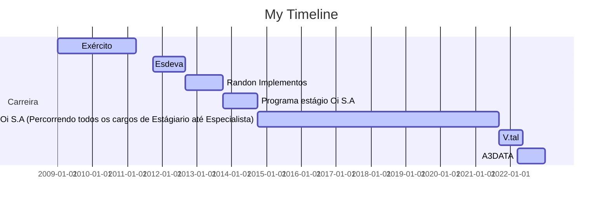

# Olá, eu sou o Wellikiandre

## 👨‍🏫 Briefing:
 
#####   Graduado em Análise e Desenvolvimento de Sistemas pela Universidade Vianna Junior (Conquistando nota máxima no Enade) e vencedor da Premiação da Maratona de Programação em SQL em parceria com a Microsoft, detenho mais de 18 cursos e certificações na área de tecnologia sendo elas na área do ecossistema de dados onde se completam nas funções coirmã de Engenheira de dados, Analista de dados e Ciência de dados, finalizando em dezembro de 2022 uma formação na Cloud AWS para Engenharia de dados

➙ 10 anos de experiência em criar soluções para TI e no ecossistema de Dados;
➙ + de 20 projetos entregues e validados. (Verificar campo projetos no Linkedin).
[Linkedin (Wellikiandre)](https://www.linkedin.com/in/wellikiandre/).

## 💼 Resumo Profissional :

###### Amante de tecnologia e compartilhador de conhecimento, acredito que o compartilhamento de conhecimento empodere pessoas e as incentiva a buscar ainda mais conhecimento através da educação. Minha intenção é contribuir para a construção de uma sociedade justa e solidária.

###### Minha carreira acadêmica e profissional nos últimos 10 anos foi dedicada ao mercado de tecnologia aplicada a soluções em negócios. Possuo larga experiência na área de  backend developer e ecossistema de dados (Análise Avançada de Dados, Ciência de Dados e engenharia de dados), aplicando na prática nos últimos anos nas empresas nas quais trabalhei, destacando Esdeva Indústria Gráfica, Randon Implementos, OI Sa, V.tal e A3Data. 

###### Até este momento da minha carreira entreguei mais de 20 projetos validados para os mais diversos nichos de mercados com soluções que entregam valor no ecossistema de dados em ambientes on-premisse e/ou cloud Azure e/ou AWS.

Skills: Desenvolvedor | Engenheiro de dados | Data Analytics | Analista de dados | Business Intelligence BI | Inteligência de negócio | Cientista de dados | AZURE | AWS | ETL ELT | JOB | SQL | JAVA | PYTHON | POWER BI | DJANGO

 
   
  
  

  <a href="https://github.com/Wellikiandre">
  
  

## Resumo Conhecimentos:
➙ Cloud Azure e Cloud AWS: Python, SQL, Spark,  Airflow, Ingestão de dados, ETL, ELT , Crawler , Automação , Jenkins , Terraform,  Cloudformation, Azure Devops, Data Factory, Kinesis , Data Lake - S3 , AWS GLUE , AWS ATHENA , REDSHIFT, Banco dados relacional e não relacional, Docker, Kubernetes e API.

➙ Controle de Versão : Git e GitHub.

➙ Backend: C, C++, SQL, JAVA , C# e Python.

➙ Data Viz = Tableau e Power BI (M e DAX ).

➙ Frontend = HTML, CSS e JavaScript.

➙ Desenvolvimento Web e Criação de Api:  Django e, Django RestFramework.

➙ Outros : Talend, SSIS , Pentaho. Padrões de desenvolvimento de projetos, orientação a objeto OO, entrega contínua, MVC , MTV, DDL, DQL, DML, DCL, TCL , BIG DATA, API REST FULL, Modelagem de dados, lógica de programação, Data Warehouse (DW) e Governança de Dados.

➙ Office : Excel Avançado com macros para dashboard internos.

## Formação Acadêmica (Todas os displomas disponíveis no linkedin)

:newspaper_roll: Engenharia de dados - How Bootcamp - (2022- Em andamento)

:newspaper_roll: Graduação em Desenvolvimento de Sistema Web - Vianna Junior - UFJF (2017 - 2019)

:newspaper_roll: Técnico Eletrônica - SENAI (2013 - 2015)

:newspaper_roll: Técnico Informática (2009 - 2011)

## Formações (Todas os displomas disponíveis no linkedin)

:computer: 2021-06 Formação BI e Data Warehouse com SQL Server e Power BI Alura, Online, BR

:computer: 2020-07 Formação SQL MICROSOFT SQL SERVER 2017 Alura, Online, BR

:computer: 2019-08 Formação Machine Learning, ,Inteligência Artificial Coti Informática, Rio de Janeiro, RJ

## Cursos (Todas os displomas disponíveis no linkedin)
* 2022-02		 Udemy : PYTHON DJANGO API REST FULL
* 2021-12    Udemy : Business Intelligence Completo do ETL ao Power BI na Prática
* 2021-07    Alura : Report Analysis com Power BI: Gerando relatórios empresariais
* 2021-06    Alura : Consultas Multidimensionais: MDX com SQL Server
* 2021-06    Alura : OLAP com SQL Server: Construção do Data Warehouse
* 2021-05    Alura : Business Intelligence: Inteligência empresarial
* 2021-05    Alura : ETL com Integration Services: Modelo de dados
* 2021-05    Alura : ETL com Integration Services: Transformação de dados
* 2020-07    Alura : ADMINISTRAÇÃO DO MICROSOFT SQL SERVER 2017
* 2020-07    Alura : CONSULTAS AVANÇADAS COM MICROSOFT SQL SERVER 2017
* 2020-07    Alura : MANIPULAÇÃO DE DADOS COM MICROSOFT SQL SERVER 2017
* 2020-07    Alura: T-SQL COM MICROSOFT SQL SERVER 2017
* 2020-06    Alura: INTRODUÇÃO AO SQL COM MICROSOFT SQL SERVER 2017
* 2020-01    Universidade Oi Educa 6 Sigma Yellow Belt + White Belt
* 2019-08    Capital Code : Github Full
* 2017-07    Pacote Office completo, Microsft Excel Dashboard e Macros(VBA)

