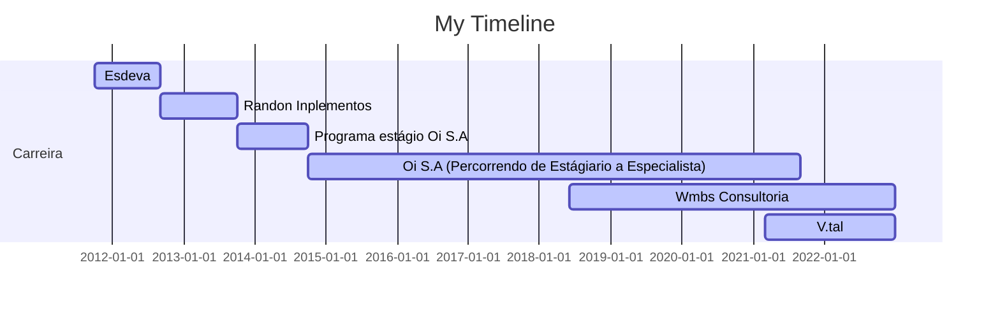

# Olá, eu sou o Wellikiandre
# Merito ao Timeline obtida pelo perfil do Téo Calvo 

Sou Graduado em Analise e desenvolvimento de sistema web (Nota máxima Enade 5) e vencedor da Premiação da Maratona de Programação e SQL, ainda detenho formação em Business Intelligence, Report Analysis com PowerBI e mais de 18 cursos e certificações na área de tecnologia.
[Linkedin (Wellikiandre)](https://www.linkedin.com/in/wellikiandre/).

Skills: Desenvolvedor | Engenharia de dados | ELT ETL | SQL | Python | Business Intelligence BI | Inteligência de negócio | Data Analytics | Analista de dados | PowerBI | Tableau | Programador | API | Django

 
   
  

  <a href="https://github.com/OctavioBigData">
  
  

## Resumo Conhecimentos:
➙ Backend : Python (Principal), SQL(Principal), Java , JavaScript , C# e PHP 
➙ Banco de dados : SqlServer, Mysql, PostgreSQL, MongoDB
➙ Orquestrador de dados ETL | JOB = Talend (SQL e JAVA) , SSIS (C# e SQL)
➙ Data Viz = Tableau e Power BI (PowerQuery, M e Dax)
➙ Frontend = HTML, CSS e JavaScript 
➙ Framework WEB = Django (Python)
➙ Office : Excel Avançado com macros para dashboard internos
➙ Controle de Versão : Git e GitHub
➙ Outros : Padrões de desenvolvimento de projetos, orientação a objeto OO, entrega contínua, MVC , MTV , DDL , DML , BIG DATA, API REST FULL
Estou estudando Cloud (AWS e AZURE) e inglês , Qlike e Airflow aos meus conhecimentos.

## Formação Acadêmica

:newspaper_roll: Graduação em Desenvolvimento de Sistema Web - Vianna Junior UFJF (2018 - 2019)

## Cursor e Formações

:computer: 2021-05 - 2021-06 BI e Data Warehouse com SQL Server e Power BI
Alura, Online, BR

