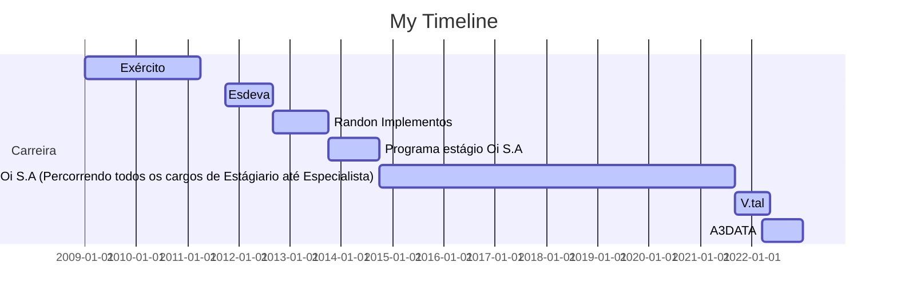

# Olá, eu sou o Wellikiandre

## 👨‍🏫 Briefing 
  Graduado em Análise e Desenvolvimento de Sistemas Web pela Universidade Vianna Junior (Conquistando nota máxima no Enade) e vencedor da Premiação da Maratona de Programação em SQL em parceria com a Microsoft, detenho também formação e cursos nas áreas de Engenharia de dados , Data Analytics , Ciência de dados. 
  Possuo mais de 18 cursos e certificações na área de tecnologia, além de ser técnico em Eletrônica pelo SENAI e Informática pelo CTU-UFJF 😅.
  Atualmente estou estudando Cloud AWS para engenharia de dados, promovido pela How Bootcamps onde estou utilizando muito SPARK, PANDAS , SQL e nos projetos estou usando os serviços da AWS como KINESIS , DATA LAKE - S3 , AWS GLUE , AWS ATHENA , REDSHIFT entre outros .
  No projeto profissional atual atrelado a A3Data estou utilizando Cloud AZURE + PowerBI como Data Viz.

➙ 10 anos de experiência em criar soluções para TI e no ecossistema de Dados;
➙ + de 20 projetos entregues e validados. (Verificar campo projetos no Linkedin).
[Linkedin (Wellikiandre)](https://www.linkedin.com/in/wellikiandre/).

## 💼 Resumo Profissional :
  Amante de tecnologia e compartilhador de conhecimento. Acredito que o compartilhamento de conhecimento empodera pessoas e as incentiva a buscar ainda mais conhecimento através da educação. Minha intenção é contribuir para a construção de uma sociedade justa e solidária.
 	Minha carreira acadêmica e profissional nos últimos 10 anos foi dedicada ao mercado de tecnologia aplicada a soluções em negócios. Possuo larga experiência na área de  backend developer e ecossistema de dados (Análise Avançada de Dados, Ciência de Dados e engenharia de dados), aplicando na prática nos últimos anos nas empresas nas quais trabalhei, destacando Esdeva Indústria Gráfica, Randon Implementos, OI Sa, V.tal e A3Data. Até este momento da minha carreira entreguei mais de 20 projetos com soluções que atenderam as mais diversas necessidades.
 	Sempre adequo meus estudos e formações às minhas atividades profissionais aplicando o conceito de “estudo sob demanda”. Ao longo da minha jornada, por onde passei até o momento, sou reconhecido como profissional dedicado, multidisciplinar e que busca trazer para sua equipe a mentalidade de atitude de dono em atividades e entregas. Sempre procuro entregar o meu melhor com o conhecimento disponível no momento, sou flexível, auto motivado, penso fora da caixa, autodidata, comunicativo, extremamente curioso e sou apaixonado em aprender coisas novas e compartilhar conhecimento adquirido para que a evolução seja mútua.
  Comecei minha carreira como técnico em eletrônica e informática, migrei para programação, desenvolvimento de software e, nos últimos anos, venho entregando valor com  desenvolvimento de soluções para o ecossistema de dados on-premisse e/ou cloud nas áreas de engenharia de dados, análise de dados e ciência de dados.

Skills: Desenvolvedor | Engenheiro de dados | Data Analytics | Analista de dados | Business Intelligence BI | Inteligência de negócio | Cientista de dados | AZURE | AWS | ETL ELT | JOB | SQL | JAVA | PYTHON | POWER BI | DJANGO

 
   
  
  

  <a href="https://github.com/Wellikiandre">
  
  

## Resumo Conhecimentos:
➙ Backend : C, C++, SQL, JAVA , C#, PHP, JavaScript e Python.
 
➙ Banco de dados ( SQL, NoSQL ): SqlServer, Mysql, MariaDB, PostgreSQL, MongoDB 
 
➙ Orquestrador de dados ETL | ELT | JOB = Talend ( SQL e JAVA ) , SQL Server Integration Services e Pentaho Data Integration.
 
➙ Data Viz = Tableau e Power BI (M e DAX ) 
 
➙ Frontend = HTML, CSS e JavaScript 
 
➙ Framework Web = Django (Python), Django RestFramework (API usando Python), Laravel e Asp net Core.
 
➙ Controle de Versão : Git e GitHub
 
➙ Outros : Docker, Padrões de desenvolvimento de projetos, orientação a objeto OO, entrega continua, MVC , MTV, DDL, DQL, DML, DCL, TCL , BIG DATA, API REST FULL, Modelagem de dados, lógica de programação.
 
➙ Office : Excel Avançado com macros para dashboard internos.
 

## Formação Acadêmica (Todas os displomas disponíveis no linkedin)

:newspaper_roll: Engenharia de dados - How Bootcamp - (2022- Em andamento)

:newspaper_roll: Graduação em Desenvolvimento de Sistema Web - Vianna Junior - UFJF (2017 - 2019)

:newspaper_roll: Técnico Eletrônica - SENAI (2013 - 2015)

:newspaper_roll: Técnico Informática (2009 - 2011)

## Formações (Todas os displomas disponíveis no linkedin)

:computer: 2021-06 Formação BI e Data Warehouse com SQL Server e Power BI Alura, Online, BR

:computer: 2020-07 Formação SQL MICROSOFT SQL SERVER 2017 Alura, Online, BR

:computer: 2019-08 Formação Machine Learning, ,Inteligência Artificial Coti Informática, Rio de Janeiro, RJ

## Cursos (Todas os displomas disponíveis no linkedin)
* 2022-02		 Udemy : PYTHON DJANGO API REST FULL
* 2021-12    Udemy : Business Intelligence Completo do ETL ao Power BI na Prática
* 2021-07    Alura : Report Analysis com Power BI: Gerando relatórios empresariais
* 2021-06    Alura : Consultas Multidimensionais: MDX com SQL Server
* 2021-06    Alura : OLAP com SQL Server: Construção do Data Warehouse
* 2021-05    Alura : Business Intelligence: Inteligência empresarial
* 2021-05    Alura : ETL com Integration Services: Modelo de dados
* 2021-05    Alura : ETL com Integration Services: Transformação de dados
* 2020-07    Alura : ADMINISTRAÇÃO DO MICROSOFT SQL SERVER 2017
* 2020-07    Alura : CONSULTAS AVANÇADAS COM MICROSOFT SQL SERVER 2017
* 2020-07    Alura : MANIPULAÇÃO DE DADOS COM MICROSOFT SQL SERVER 2017
* 2020-07    Alura: T-SQL COM MICROSOFT SQL SERVER 2017
* 2020-06    Alura: INTRODUÇÃO AO SQL COM MICROSOFT SQL SERVER 2017
* 2020-01    Universidade Oi Educa 6 Sigma Yellow Belt + White Belt
* 2019-08    Capital Code : Github Full
* 2017-07    Pacote Office completo, Microsft Excel Dashboard e Macros(VBA)

