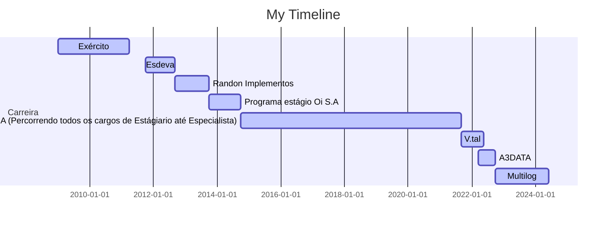

# Olá, eu me chamo Wellikiandre Martins.
#### [Meu Linkedin](https://www.linkedin.com/in/wellikiandre/) , [Meu Curriculum](https://docs.google.com/document/d/1mX-EtqGDNQxiE8f8kMF0eon6iOelTQTK/edit?usp=sharing&ouid=116609682125162317803&rtpof=true&sd=true) , [Projetos Reais](https://www.linkedin.com/in/wellikiandre/details/projects/) , [Me contate 🚀](https://linktr.ee/wellikiandre)

🚀 Profissional de alto desempenho com +10 Anos de Experiência e + 30 Projetos em TI

Wellikiandre é um entusiasta de TI autodidata, inspirado pela inovação e de soluções de problemas para negócios, segue a filosofia MAMBA e tem como referência os visionários Elon Musk, Jeff Bezos e Satya Nadella, ele busca incessantemente soluções disruptivas, ele acredita no poder transformador da tecnologia e está sempre em busca de aprimoramento.

Graduado em Análise e Desenvolvimento de Sistemas, com honras máximas no ENADE, pela Universidade Vianna Junior, parceira Microsoft. Possui recomendações de líderes de mercado e certificações em suporte a tomada de decisão, Engenharia de Dados, Azure, DataBricks e AWS.

Atualmente é o Engenharia e Arquiteto responsável na Multilog, seus 10 anos em TI o fez adquirir uma visão holística e especializada, que se destaca nas áreas de Desenvolvimento de software, Big Data & Analytics, Engenharia de Soluções cloud e on-premisse, infraestrutura, DBA e Liderança de Equipes de alto desempenho. 

Suas habilidades em Learning Agility, Comunicação, Escuta Ativa são complementadas em mais de 30 projetos de sucesso, que sumarizam milhões de reais em redução de custo, aumento de receita e mudança cultural, em empresas como Multilog, A3Data, V.tal, Oi S.A, Randon (Mercedes-Benz).

A paixão pela busca do conhecimento começou na infância, inspirada pela dedicação de uma mãe que gerenciava dois empregos e cuidava sozinha da casa. Acompanhando-a no trabalho, absorveu desde cedo os valores de uma vida repleta de esforço e gratidão. Movido pela educação e pelo compromisso com uma sociedade mais justa, se tornou palestrante e mentor de profissionais.

🏆 Projetos: (Acesse projetos no linkedin)

• Projetos na Copa do Mundo FIFA, Olimpíadas no Brasil, migrações de sistemas da Oi SA to V.tal. \n
• Desenvolvimento de Arquitetura Moderna de dados como solução Big Data na Multilog. \n
• Redução de custos na Arquitetura de dados da Multilog. \n
• Disponibilização de dados em near real-time para diversas áreas na Multilog. \n
• Assistente Inteligente: Automação de processos em monitoramento na arquitetura de dados da Multilog. \n

🛠️ Key Skills:

• Gestão de Recursos e Custo, Segurança, Governança de Dados, DevOps e DataOps \n
• Cloud: Azure, DataBricks, AWS \n
• SQL, JAVA, C#, Python, Spark, PySpark, Spark SQL \n
• OLAP, OLTP, Data Lakes, Data Lakehouse, Modern Data Warehouse \n
• Oracle, SQL Server, SAP HANA, MySQL, PostgreSQL, MongoDB, Redshift \n
• Airbyte, Synapse, Data Factory, Talend, SSIS \n
• Git, GitHub, Azure DevOps \n
• CI/CD,Docker, Kubernetes \n
• Metabase, Power BI, Excel, VBA \n

## Formação Acadêmica (Todas os displomas disponíveis no linkedin)

:newspaper_roll: Engenharia de Dados AWS | Databricks | Apache Airflow | Spark | Python | SQL - How Bootcamp - (2022)

:newspaper_roll: Engenharia de Dados e Big Data Azure e Databricks (DP-203) - (2022)

:newspaper_roll: Graduação em Desenvolvimento de Sistema Web - Vianna Junior - UFJF (2017 - 2019)

:newspaper_roll: Técnico Eletrônica - SENAI (2013 - 2015)

:newspaper_roll: Técnico Informática (2009 - 2011)

## Formações (Todas os displomas disponíveis no linkedin)

:computer: 2021-06 Formação BI e Data Warehouse com SQL Server e Power BI Alura, Online, BR

:computer: 2020-07 Formação SQL MICROSOFT SQL SERVER 2017 Alura, Online, BR

:computer: 2019-08 Formação Machine Learning, ,Inteligência Artificial Coti Informática, Rio de Janeiro, RJ

## Cursos (Todas os displomas disponíveis no linkedin)

* 2024-01		  Engenharia de Dados Academy : Databricks SQL - From zero to Hero
* 2024-01		  Conquer : Produtividade e Performance
* 2023-10		  Engenharia de Dados Academy : Big Data Databricks SQL -Plataforma unificada de dados
* 2023-07    Databricks : Certification Databricks lakehouse platform (v2)
* 2023-07    Engenharia de Dados Academy : Python para Engenharia de dados
* 2023-06		  Engenharia de Dados Academy : Git para time de dados
* 2023-06		  Engenharia de Dados Academy : SQL para time de dados
* 2023-05    Office IT : ITIL® 4 FoundationITIL® 4 Foundation
* 2022-10    Azure Academy: Engenharia de dados e Big Data, Databricks (DP-203)
* 2022-02		  Udemy : PYTHON DJANGO API REST FULL
* 2021-12    Udemy : Business Intelligence Completo do ETL ao Power BI na Prática
* 2021-07    Alura : Report Analysis com Power BI: Gerando relatórios empresariais
* 2021-06    Alura : Consultas Multidimensionais: MDX com SQL Server
* 2021-06    Alura : OLAP com SQL Server: Construção do Data Warehouse
* 2021-05    Alura : Business Intelligence: Inteligência empresarial
* 2021-05    Alura : ETL com Integration Services: Modelo de dados
* 2021-05    Alura : ETL com Integration Services: Transformação de dados
* 2020-07    Alura : ADMINISTRAÇÃO DO MICROSOFT SQL SERVER 2017
* 2020-07    Alura : CONSULTAS AVANÇADAS COM MICROSOFT SQL SERVER 2017
* 2020-07    Alura : MANIPULAÇÃO DE DADOS COM MICROSOFT SQL SERVER 2017
* 2020-07    Alura: T-SQL COM MICROSOFT SQL SERVER 2017
* 2020-06    Alura: INTRODUÇÃO AO SQL COM MICROSOFT SQL SERVER 2017
* 2020-01    Universidade Oi Educa 6 Sigma Yellow Belt + White Belt
* 2019-08    Capital Code : Github Full
* 2017-07    Pacote Office completo, Microsft Excel Dashboard e Macros(VBA)

