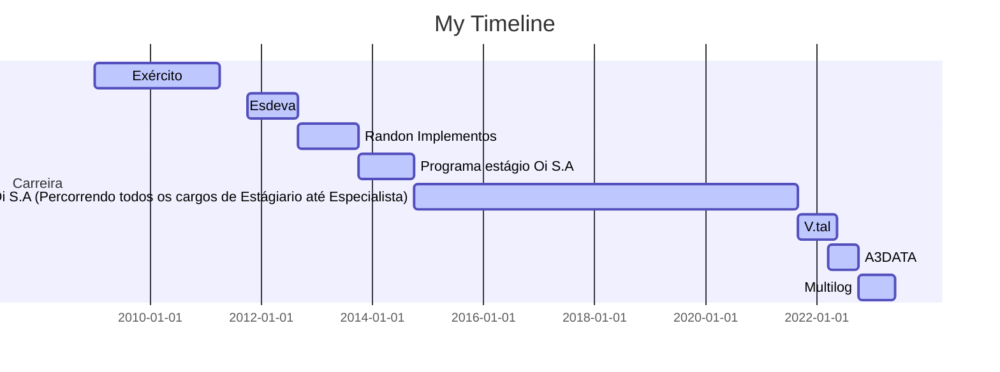

# Olá, eu sou o Wellikiandre [Linkedin](https://www.linkedin.com/in/wellikiandre/) , [Curriculum](https://docs.google.com/document/d/1mX-EtqGDNQxiE8f8kMF0eon6iOelTQTK/edit?usp=sharing&ouid=116609682125162317803&rtpof=true&sd=true).

## 👨‍🏫 Briefing:
 
   Me considero um amante da tecnologia e compartilhador de conhecimento, acredito que a informação empodera pessoas e as incentiva através da educação a buscar uma vida mais digna, por isso sou mentor voluntário para pessoas que desejam migrar para área de tecnologia assim contribuindo para uma sociedade mais justa e solidária.

   Graduado em Análise e Desenvolvimento de Sistemas na Universidade Vianna Junior parceira Microsoft (Obtendo nota máxima no ENADE "Eleita a melhor Graduação de Minas Gerais e Segunda melhor do Brasil), Técnico em Eletrônica pelo SENAI e Informática pelo CTU.

   👨‍🎓19 certificações e cursos na área de tecnologia, sendo as mais recentes em Engenharia de dados Azure + DataBricks e Engenharia de Dados na AWS. Estas certificações e cursos visaram amparar meu desenvolvimento e capacitação na entrega de mais 20 projetos profissionais dos mais diversos perfis ao longo da carreira.

➙ 10 anos de experiência em criar soluções para TI e no ecossistema de Dados;
➙ + de 20 projetos entregues e validados. (Verificar campo projetos no Linkedin).

## 💼 Resumo Profissional :

Tenho larga experiência como Engenharia de Dados , Data Analytics, Engenharia de Software e Infra.

Possuo entregáveis de que já somam milhões de reais em redução de custo em aperfeiçoamento e otimização em arquitetura de dados desde um pipeline até a uma arquitetura completa de dados.

Apliquei na prática nos últimos 10 anos em empresas como Esdeva Indústria Gráfica(Revista Veja e Jornal Tribuna de Minas), Randon (Mercedes-Benz), Oi SA / V.tal (Telecom, O&M, PCP, Performance e Produção, Gestão de Terceiros, Projetos, NPS, Marketing, Logística, Controladoria e Auditoria), A3Data (Consultoria de implantação de 
Data Driven, Engenharia de dados ,Inteligência Artificial e ML) e atualmente na Multilog com a democratização dos dados com a implementação do Delta LakeHouse, municiando projetos de ML, Análise Avançada e Inteligência Artificial.

#### Skills de Palavra Chave:

C, C++, SQL, JAVA , C#, Python , SPARK e PySpark.
DataBricks | Cloud AWS | Cloud Azure | ELT | ETL | Delta Lake |
Blob Storage | Data Lake | Data LakeHouse | Data Factory | Data Flow | Azure Synapse Studio | Dedicated SQL Pool | Serveless SQL Pool | Apache Spark Pool | Airflow | Crawler | Jenkins | Terraform | Cloudformation | Azure Devops | AWS Synapse | Kinesis | Data Store | Data Lake - S3 | AWS GLUE | AWS ATHENA | REDSHIFT | Docker | Kubernetes | API | Git | GitHub | Power BI (M e DAX) | Talend | SSIS | Orientação a Objeto OO | Entrega contínua | MVC | MTV | DDL | DQL | DML | DCL | TCL
Gerenciamento de Recursos e Custo | Segurança | Governança de Dados

## Formação Acadêmica (Todas os displomas disponíveis no linkedin)

:newspaper_roll: Engenharia de Dados AWS | Databricks | Apache Airflow | Spark | Python | SQL - How Bootcamp - (2022)

:newspaper_roll: Engenharia de Dados e Biga Data Azure e Databricks (DP-203) - (2022)

:newspaper_roll: Graduação em Desenvolvimento de Sistema Web - Vianna Junior - UFJF (2017 - 2019)

:newspaper_roll: Técnico Eletrônica - SENAI (2013 - 2015)

:newspaper_roll: Técnico Informática (2009 - 2011)

## Formações (Todas os displomas disponíveis no linkedin)

:computer: 2021-06 Formação BI e Data Warehouse com SQL Server e Power BI Alura, Online, BR

:computer: 2020-07 Formação SQL MICROSOFT SQL SERVER 2017 Alura, Online, BR

:computer: 2019-08 Formação Machine Learning, ,Inteligência Artificial Coti Informática, Rio de Janeiro, RJ

## Cursos (Todas os displomas disponíveis no linkedin)
* 2022-02		 Udemy : PYTHON DJANGO API REST FULL
* 2021-12    Udemy : Business Intelligence Completo do ETL ao Power BI na Prática
* 2021-07    Alura : Report Analysis com Power BI: Gerando relatórios empresariais
* 2021-06    Alura : Consultas Multidimensionais: MDX com SQL Server
* 2021-06    Alura : OLAP com SQL Server: Construção do Data Warehouse
* 2021-05    Alura : Business Intelligence: Inteligência empresarial
* 2021-05    Alura : ETL com Integration Services: Modelo de dados
* 2021-05    Alura : ETL com Integration Services: Transformação de dados
* 2020-07    Alura : ADMINISTRAÇÃO DO MICROSOFT SQL SERVER 2017
* 2020-07    Alura : CONSULTAS AVANÇADAS COM MICROSOFT SQL SERVER 2017
* 2020-07    Alura : MANIPULAÇÃO DE DADOS COM MICROSOFT SQL SERVER 2017
* 2020-07    Alura: T-SQL COM MICROSOFT SQL SERVER 2017
* 2020-06    Alura: INTRODUÇÃO AO SQL COM MICROSOFT SQL SERVER 2017
* 2020-01    Universidade Oi Educa 6 Sigma Yellow Belt + White Belt
* 2019-08    Capital Code : Github Full
* 2017-07    Pacote Office completo, Microsft Excel Dashboard e Macros(VBA)

