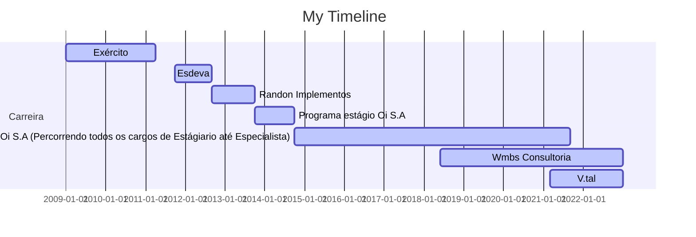

# Olá, eu sou o Wellikiandre
#### Merito ao Timeline obtida pelo perfil do Téo Calvo 

Sou Graduado em Analise e desenvolvimento de sistema web (Nota máxima Enade 5) e vencedor da Premiação da Maratona de Programação e SQL, ainda detenho formação em Business Intelligence, Report Analysis com PowerBI e mais de 18 cursos e certificações na área de tecnologia.
[Linkedin (Wellikiandre)](https://www.linkedin.com/in/wellikiandre/).

Skills: Desenvolvedor | Engenharia de dados | ELT ETL | SQL | Python | Business Intelligence BI | Inteligência de negócio | Data Analytics | Analista de dados | PowerBI | Tableau | Programador | API | Django

 
   
  
  

  <a href="https://github.com/Wellikiandre">
  
  

## Resumo Conhecimentos:
* ➙ Backend : Python (Principal), SQL(Principal), Java , JavaScript , C# e PHP 
* ➙ Banco de dados : SqlServer, Mysql, PostgreSQL, MongoDB
* ➙ Orquestrador de dados ETL | JOB = Talend (SQL e JAVA) , SSIS (C# e SQL)
* ➙ Data Viz = Tableau e Power BI (PowerQuery, M e Dax)
* ➙ Frontend = HTML, CSS e JavaScript 
* ➙ Framework WEB = Django (Python)
* ➙ Office : Excel Avançado com macros para dashboard internos
* ➙ Controle de Versão : Git e GitHub
* ➙ Outros : Padrões de desenvolvimento de projetos, orientação a objeto OO, entrega contínua, MVC , MTV , DDL , DML , BIG DATA, API REST FULL
* Estou estudando Cloud (AWS e AZURE) e inglês , Qlike e Airflow aos meus conhecimentos.

## Formação Acadêmica (Todas os displomas disponíveis no linkedin)

:newspaper_roll: Graduação em Desenvolvimento de Sistema Web - Vianna Junior UFJF (2018 - 2019)

## Formações (Todas os displomas disponíveis no linkedin)

:computer: 2021-06 Formação BI e Data Warehouse com SQL Server e Power BI Alura, Online, BR
:computer: 2020-07 Formação SQL MICROSOFT SQL SERVER 2017 Alura, Online, BR
:computer: 2019-08 Formação Machine Learning, ,Inteligência Artificial Coti Informática, Rio de Janeiro, RJ

## Cursos (Todas os displomas disponíveis no linkedin)
*2022-02		Udemy : PYTHON DJANGO API REST FULL
*2021-12    Udemy : Business Intelligence Completo do ETL ao Power BI na Prática
*2021-07    Alura : Report Analysis com Power BI: Gerando relatórios empresariais
*2021-06    Alura : Consultas Multidimensionais: MDX com SQL Server
*2021-06    Alura : OLAP com SQL Server: Construção do Data Warehouse
*2021-05    Alura : Business Intelligence: Inteligência empresarial
*2021-05    Alura : ETL com Integration Services: Modelo de dados
*2021-05    Alura : ETL com Integration Services: Transformação de dados
*2020-07    Alura : ADMINISTRAÇÃO DO MICROSOFT SQL SERVER 2017
*2020-07    Alura : CONSULTAS AVANÇADAS COM MICROSOFT SQL SERVER 2017
*2020-07    Alura : MANIPULAÇÃO DE DADOS COM MICROSOFT SQL SERVER 2017
*2017-07    Especialista em Microsft Excel Dashboard e Macros(VBA)
*2020-07    Alura: T-SQL COM MICROSOFT SQL SERVER 2017
*2020-06    Alura: INTRODUÇÃO AO SQL COM MICROSOFT SQL SERVER 2017
*2020-01    Universidade Oi Educa6 Sigma Yellow Belt + White Belt
*2019-08    Capital Code : Github Full

